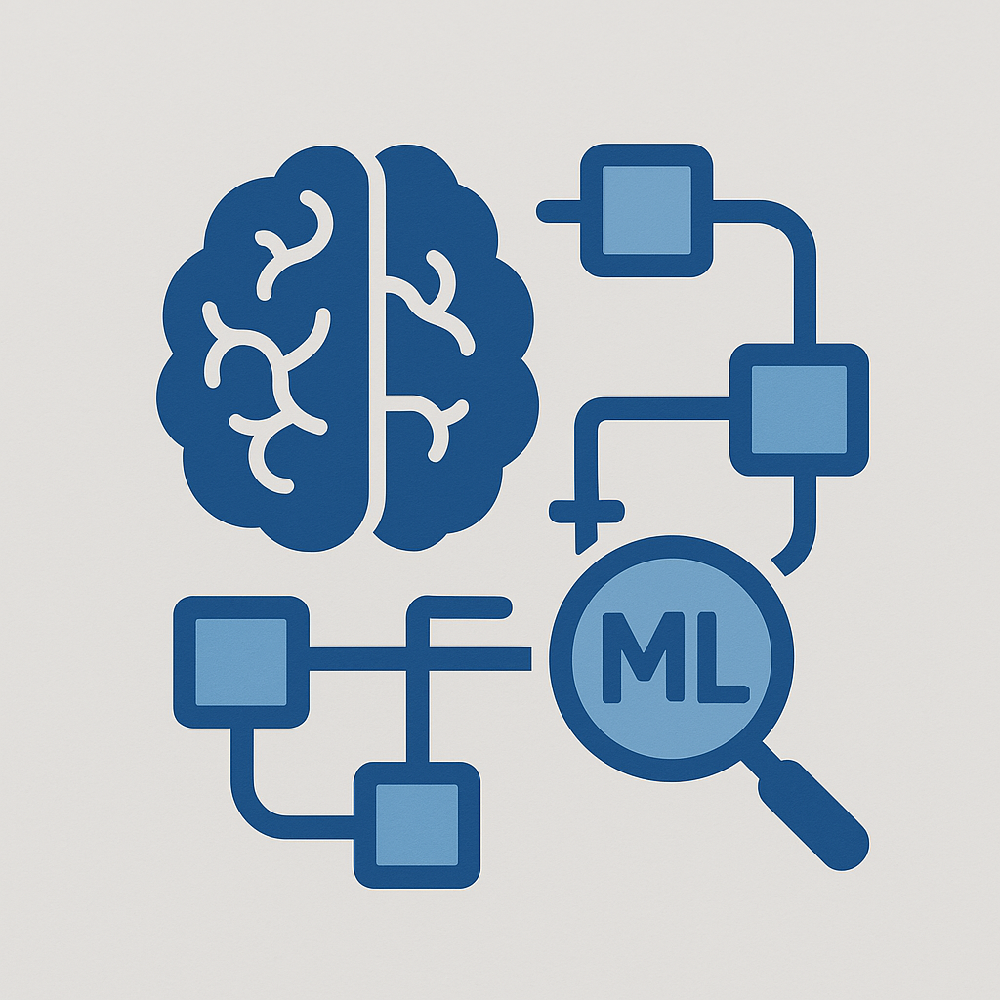

<a id="readme-top"></a>

[![Contributors][contributors-shield]][contributors-url]
[![Forks][forks-shield]][forks-url]
[![Stargazers][stars-shield]][stars-url]
[![Issues][issues-shield]][issues-url]
[![project_license][license-shield]][license-url]
[![LinkedIn][linkedin-shield]][linkedin-url]


<br />
<div align="center">
  <a href="https://github.com/victorgreggio/ml_cpp_pipeline">
    
  </a>

<h3 align="center">C++ Machine Learning Pipeline</h3>

  <p align="center">
    A simple and modular machine learning pipeline implemented in C++ for data extraction, preprocessing, model training, and inference. This project is designed to demonstrate how to structure a basic ML workflow using some C++ tools/libraries.
  </p>
</div>

<!-- TABLE OF CONTENTS -->
<details>
  <summary>Table of Contents</summary>
  <ol>
    <li>
      <a href="#about-the-project">About The Project</a>
    </li>
    <li>
      <a href="#getting-started">Getting Started</a>
      <ul>
        <li><a href="#prerequisites">Prerequisites</a></li>
        <li><a href="#steps">Steps</a></li>
      </ul>
    </li>
    <li><a href="#contributing">Contributing</a></li>
    <li><a href="#license">License</a></li>
    <li><a href="#contact">Contact</a></li>
  </ol>
</details>


<!-- ABOUT THE PROJECT -->
## About The Project

This project showcases a simple end-to-end machine learning pipeline using C++ tools/libraries. The core idea is to demonstrate how real-world data can be extracted from a database, processed, and used to train a classification model—all while navigating different data file formats and deploying the result as a service.

* <b>Data Extraction</b> Data is initially fetched from a PostgreSQL database, simulating a typical structured source in enterprise environments.
* <b>Format Flexibility</b> The extracted data is saved in HDF5 (.h5) format to illustrate how large, hierarchical datasets can be handled efficiently. It’s later converted to CSV purely for demonstration, showing interoperability across file formats.
* <b>Preprocessing</b> A lightweight data wrangling step is applied to clean and prepare the data for training. This could include normalization, label encoding, or filtering—depending on the dataset structure.
* <b>Model Training</b> A simple classification model is trained using the classic Iris dataset structure. The model is purposefully kept minimal to focus on pipeline structure rather than algorithmic complexity.
* <b>Model Serving</b> Once trained, the model is deployed via a gRPC service, allowing clients to perform real-time inference remotely.

<p align="right">(<a href="#readme-top">back to top</a>)</p>


<!-- GETTING STARTED -->
## Getting Started

These steps will walk you through configuring your local machine to build and run the project.

### Prerequisites
* [Visual Studio Build Tools](https://aka.ms/vs/17/release/vs_BuildTools.exe)
* [PostgreSQL](https://www.postgresql.org/download/)
  1. Download and install PostgreSQL.
  2. Using postgres or other admin account execute the script ```data\db.sql```
  3. Login using iris user and execute the other two scripts: ```data\ddl.sql``` and ```data\dml.sql```

### Steps

1. Clone the repo
   ```sh
   git clone https://github.com/victorgreggio/ml_cpp_pipeline.git
   ```
2. Build
   ```scripts\build.ps1```
4. Run service
   ```scripts\run_service.ps1```
5. Run client
   ```build\{presetName}\service\{configuration}\client.exe```

<p align="right">(<a href="#readme-top">back to top</a>)</p>


<!-- CONTRIBUTING -->
## Contributing

Contributions are what make the open source community such an amazing place to learn, inspire, and create. Any contributions you make are **greatly appreciated**.

If you have a suggestion that would make this better, please fork the repo and create a pull request. You can also simply open an issue with the tag "enhancement".
Don't forget to give the project a star! Thanks again!

1. Fork the Project
2. Create your Feature Branch (`git checkout -b feature/AmazingFeature`)
3. Commit your Changes (`git commit -m 'Add some AmazingFeature'`)
4. Push to the Branch (`git push origin feature/AmazingFeature`)
5. Open a Pull Request

<p align="right">(<a href="#readme-top">back to top</a>)</p>

### Top contributors:

<a href="https://github.com/victorgreggio/ml_cpp_pipeline/graphs/contributors">
  
</a>


<!-- LICENSE -->
## License

Distributed under the Unlicense License. See `LICENSE.txt` for more information.

<p align="right">(<a href="#readme-top">back to top</a>)</p>


<!-- CONTACT -->
## Contact

Project Link: [https://github.com/victorgreggio/ml_cpp_pipeline](https://github.com/victorgreggio/ml_cpp_pipeline)

<p align="right">(<a href="#readme-top">back to top</a>)</p>


<!-- MARKDOWN LINKS & IMAGES -->
<!-- https://www.markdownguide.org/basic-syntax/#reference-style-links -->
[contributors-shield]: https://img.shields.io/github/contributors/victorgreggio/ml_cpp_pipeline.svg?style=for-the-badge
[contributors-url]: https://github.com/victorgreggio/ml_cpp_pipeline/graphs/contributors
[forks-shield]: https://img.shields.io/github/forks/victorgreggio/ml_cpp_pipeline.svg?style=for-the-badge
[forks-url]: https://github.com/victorgreggio/ml_cpp_pipeline/network/members
[stars-shield]: https://img.shields.io/github/stars/victorgreggio/ml_cpp_pipeline.svg?style=for-the-badge
[stars-url]: https://github.com/victorgreggio/ml_cpp_pipeline/stargazers
[issues-shield]: https://img.shields.io/github/issues/victorgreggio/ml_cpp_pipeline.svg?style=for-the-badge
[issues-url]: https://github.com/victorgreggio/ml_cpp_pipeline/issues
[license-shield]: https://img.shields.io/github/license/victorgreggio/ml_cpp_pipeline.svg?style=for-the-badge
[license-url]: https://github.com/victorgreggio/ml_cpp_pipeline/blob/master/LICENSE.txt
[linkedin-shield]: https://img.shields.io/badge/-LinkedIn-black.svg?style=for-the-badge&logo=linkedin&colorB=555
[linkedin-url]: https://linkedin.com/in/victor-greggio-75a7332a/
